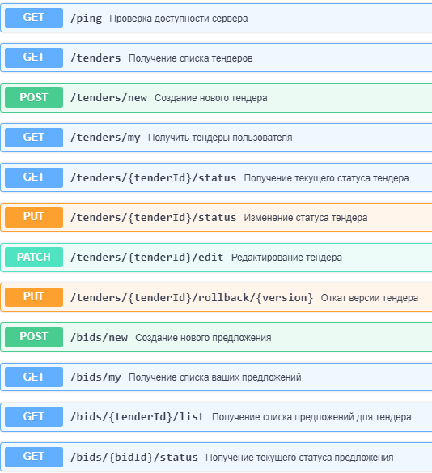
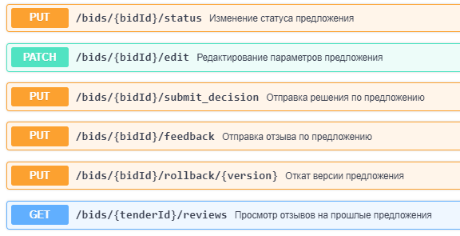

# Tender Service API

## Описание

Tender Service API - это приложение для управления тендерами и предложениями. Оно позволяет создавать, обновлять и управлять тендерами и предложениями, а также отправлять решения и отзывы.

## Установка

### Предварительные требования

- Python 3
- Docker

### Установка зависимостей

1. Клонируйте репозиторий:

```Bash
    git clone <git@git.codenrock.com:avito-testirovanie-na-backend-1270/cnrprod1725724889-team-77779/zadanie-6105.git>
    cd app
```
2. Создайте виртуальное окружение и активируйте его:

```Bash
    python -m venv venv
    source venv/bin/activate  # На Linux
    venv\Scripts\activate  # На Windows
```    
    
3. Установите зависимости:

```Bash
pip install -r requirements.txt
```

## Запуск приложения

1. Постройте Docker образ:
```Bash
docker build -t tender-service-api .
```    

2. Запустите контейнер:
```Bash
    docker run -p 8080:8080 tender-service-api
```    

## Работа с приложением

### API эндпоинты


